# eumet-stream

[](https://github.com/OWNER/eumet-stream/actions/workflows/ci.yml)
[](LICENSE)

A Rust web application that renders live EUMETCast satellite imagery of Europe
in colour, over a rolling 6, 12, 24 or 48 hour window — or any stretch of the
past your receiver still holds.

Everything is decoded from the files your receiver already writes to disk. No
external service, no database, no basemap download, and — apart from EUMETSAT's
own wavelet decompressor — no native code.

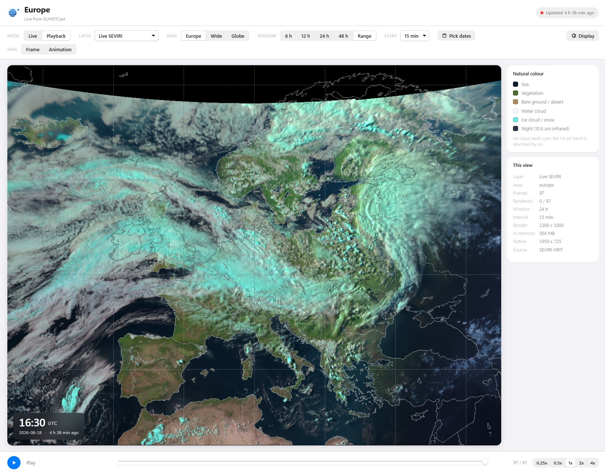

## What you need

This reads a **EUMETCast** reception directory. It is not a client for a public
API and there is no demo mode: without a receiver writing files to disk, it
starts, reports `frames indexed: 0`, and withdraws every layer.

- A **EUMETCast** receiver writing NWC SAF products and/or SEVIRI HRIT to disk
  (the usual `E1B-GEO-*` channel directories).
- **Rust** (stable) to build it.
- **Windows** for the SEVIRI layers specifically, because EUMETSAT's wavelet
  decompressor is built with MSVC by the helper script. The NWC SAF layers work
  anywhere, and the only platform-specific code in the crate is the one call
  that asks how much memory the machine has — see [Caching](#caching).

### Getting EUMETCast data

[EUMETSAT](https://www.eumetsat.int) is the European operator of the Meteosat
satellites, and **EUMETCast** is how it broadcasts their data — over satellite
(DVB) and over the internet. It is not a public API you can just call: you
register, are granted access to particular services, and receive a stream that
your own reception software writes to disk. This viewer starts where that
software stops.

Roughly, from nothing to imagery on screen:

1. **Register** at the [EUMETSAT User Portal](https://user.eumetsat.int). This
   is the account that everything else hangs off, and it is free.
2. **Subscribe to the services you want.** For this viewer that means the
   Meteosat SEVIRI **HRIT** stream and/or the **NWC SAF** products. Each is a
   separate entitlement on your account.
3. **Set up reception.** Satellite reception needs a dish, a DVB-S2 card or box,
   and EUMETSAT's client software; the internet-delivered variant needs only the
   client. Either way the client is what writes the `E1B-GEO-*` directories this
   reads. EUMETSAT documents the hardware and the client setup on its site and
   in the User Portal.
4. **Point this at those directories** with `--dir`, `--hrit-dir` and
   `--disc-dir`, below.

Two related projects worth knowing:

- **[NWC SAF](https://www.nwcsaf.org)** — the Satellite Application Facility that
  produces the cloud mask, cloud type and cloud-top products four of the layers
  here are built from. Their NWC/GEO package is what generates the `S_NWC_*.nc`
  files.
- **[PublicDecompWT](https://gitlab.eumetsat.int/open-source/PublicDecompWT)** —
  EUMETSAT's own wavelet decompressor for xRIT, Apache-2.0. The HRIT pixel data
  is wavelet-compressed and there is no Rust implementation, so this is built
  once and used as a helper. See [The wavelet decompressor](#the-wavelet-decompressor).

If you have no receiver and only want to look at Meteosat imagery, this is the
wrong tool — EUMETSAT publishes browsable imagery on its own site, and the
[EUMETSAT Data Store](https://user.eumetsat.int) serves archived products
through the same account.

## Layers at a glance

| | |
|---|---|
| 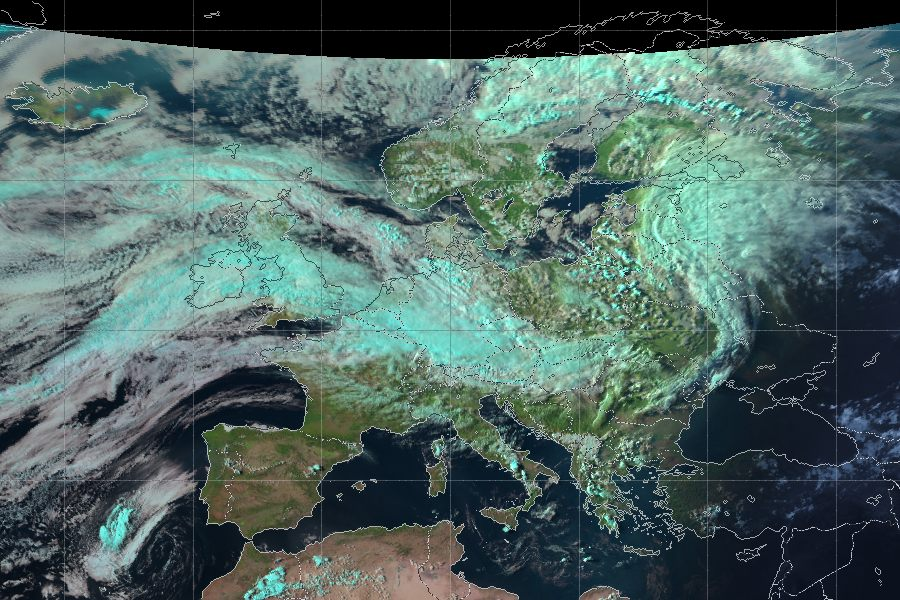 **Live SEVIRI** — the real picture, natural colour by day and colourised infrared by night | 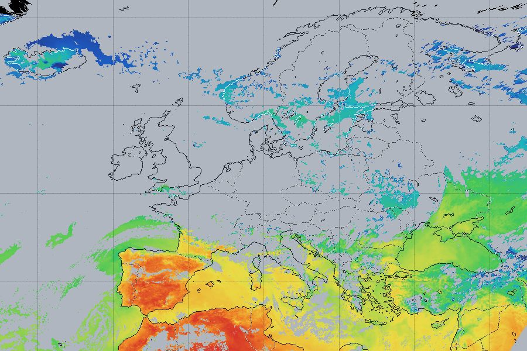 **Surface heat** — how warm the ground and sea are, with cloud masked away |
| 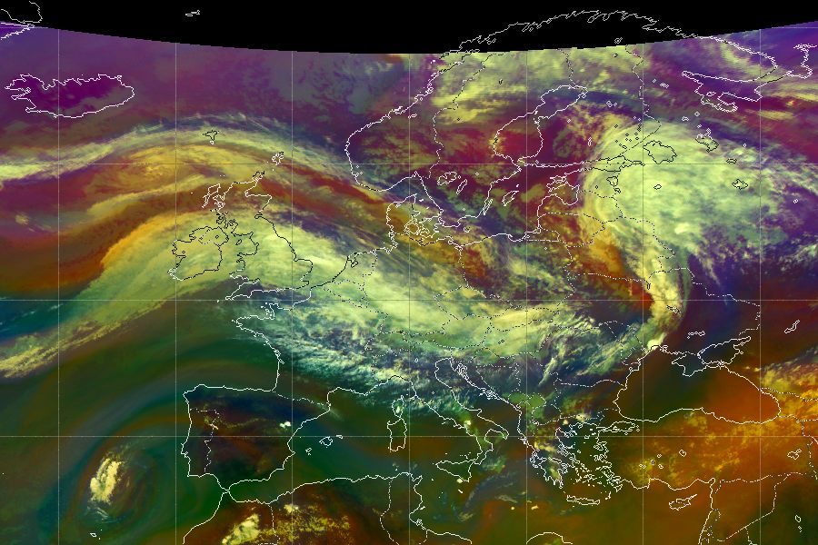 **Airmass** — jet streams and stratospheric intrusions | 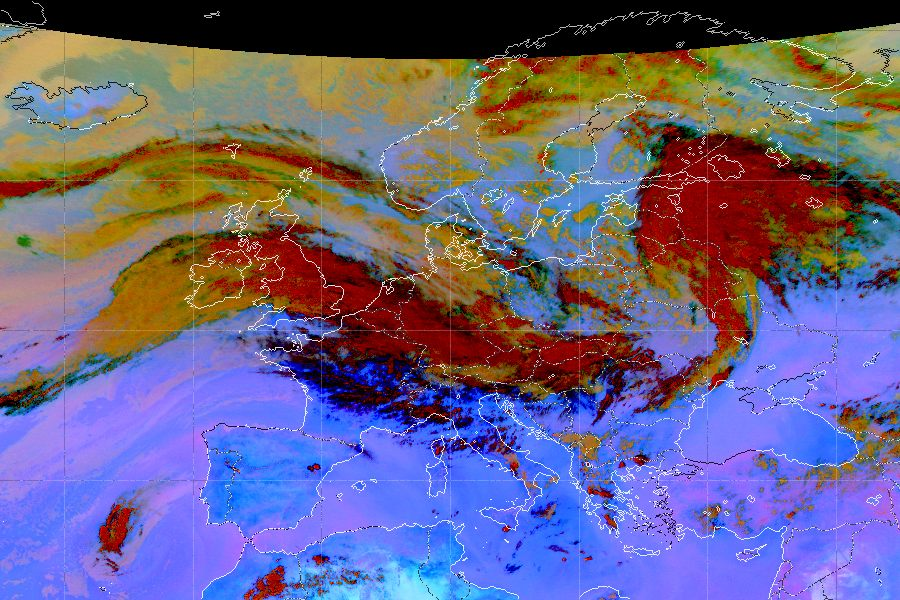 **Dust** — Saharan dust and volcanic ash |
| 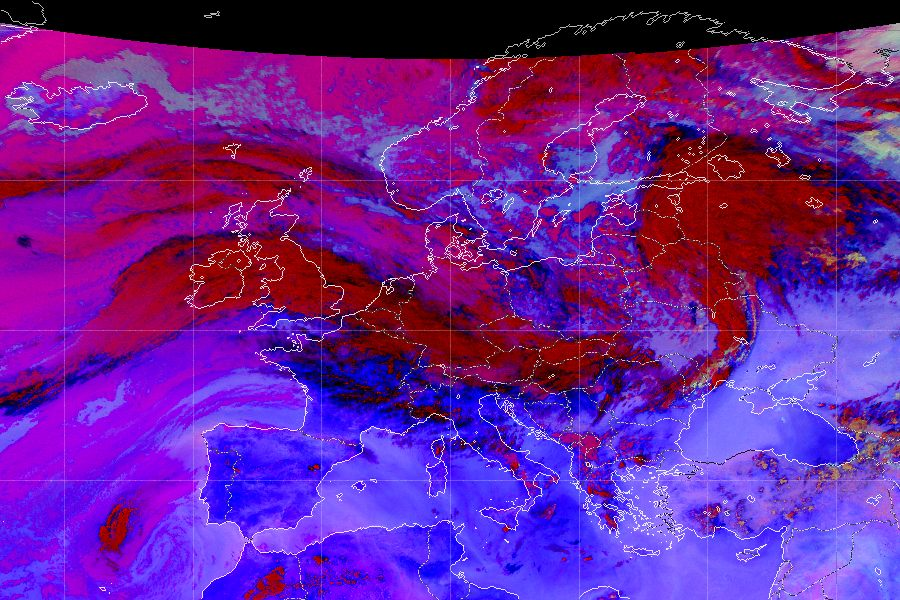 **Night microphysics** — fog and low stratus in the dark | 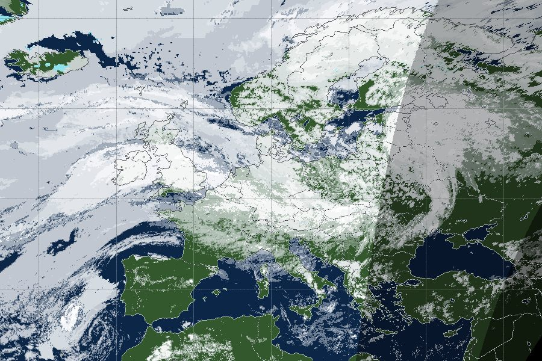 **Earth (natural)** — derived basemap with a real day/night terminator |
| 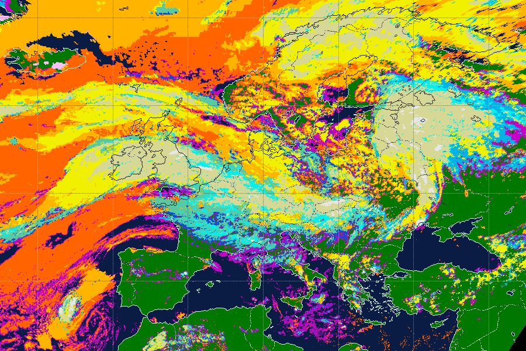 **Cloud type** — the official 15-class NWC SAF palette | 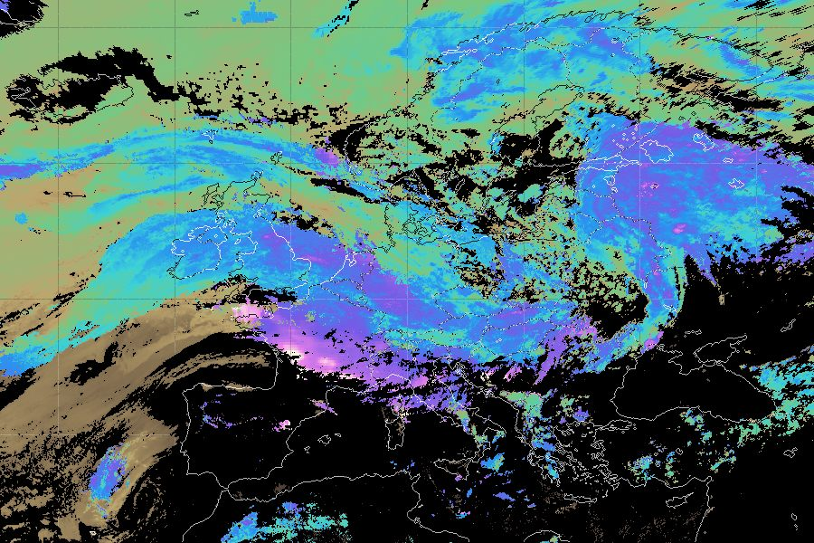 **Cloud top temperature** — continuous ramp, 200–300 K |

The ninth, **Cloud top height**, is not pictured: it is the same `CTTH` data as
cloud top temperature on a 0–13 km ramp, so the two look alike at a glance and
differ in what the ramp means. All nine are in [Layers](#layers).

The five raw-imagery layers also draw the **whole disc**:

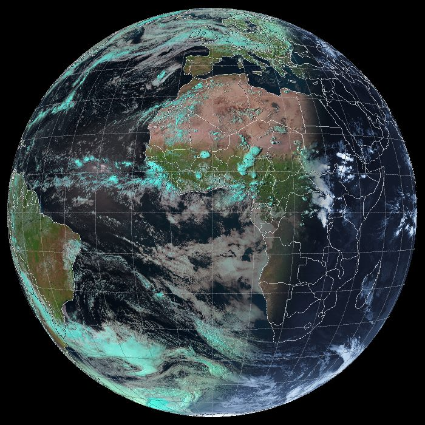

## Features

**Nine layers** over **three areas** — Europe, a wider window, and the full
Earth disc. Five are built from the raw SEVIRI stream and four from the NWC SAF
products; whichever your receiver supplies is what you get offered.

**Two ways to choose time.** A rolling window of the last 6, 12, 24 or 48 hours,
or a **date range** picked from a calendar that marks only the days your
receiver actually holds. A range keeps both ends: too many frames coarsens the
interval rather than cutting the span short.

**Playback that renders first.** Press Play and it builds the whole window,
counting frames and estimating the wait, then animates once everything is in
hand — at **0.25x to 4x**, with a pause at the loop so the wrap does not read as
the weather jumping backwards.

**Live mode** drops the timeline and just holds the newest image, refreshing as
slots arrive.

**It follows your receiver.** A poll every 45 seconds notices new data and
extends the timeline without a reload, keeping your place. A coloured pill in
the toolbar shows how old the newest image is.

**Overlays** — coastlines and country borders drawn from vector data, with ink
that adapts per pixel so the lines stay visible over both black sea and white
cloud, plus a graticule and an optional marker for where you are.

**Export** a single frame as PNG, or the whole window as an animated GIF or
APNG, at the size on screen so it reuses what has already been rendered.

**Resolution** from automatic through to one output pixel per source sample, and
a **light/dark theme** that follows the system or can be set.

**It reads your files and nothing else.** No external service, no database, no
basemap download, no telemetry. Optionally serves to the rest of your network,
and optionally deletes received data past a retention period.

## Using it

The toolbar left to right, then the bar along the bottom.

| control | what it does |
|---|---|
| **Mode** | *Live* holds the newest image; *Playback* gives you the timeline. |
| **Layer** | The nine layers. Which appear depends on the data you have and the area — the globe offers only the raw-imagery five. |
| **Area** | Europe, Wide, Globe. |
| **Window** | 6/12/24/48 h back from the newest frame — or **Range**, which reveals a date button. |
| **Every** | Frame interval, 5 min to 6 h. Rapid Scan arrives every 5 minutes and the full disc every 15, so each layer offers what it can supply. |
| **Display** | A popover for the settings you set once: resolution, overlays, my location, theme. |
| **Save** | *Frame* writes a PNG; *Animation* writes a GIF of the whole window. |

Along the bottom: **Play**, a label that doubles as the render progress and
estimate, the **timeline** with a buffer bar behind it, the frame counter, and
the **speed**.

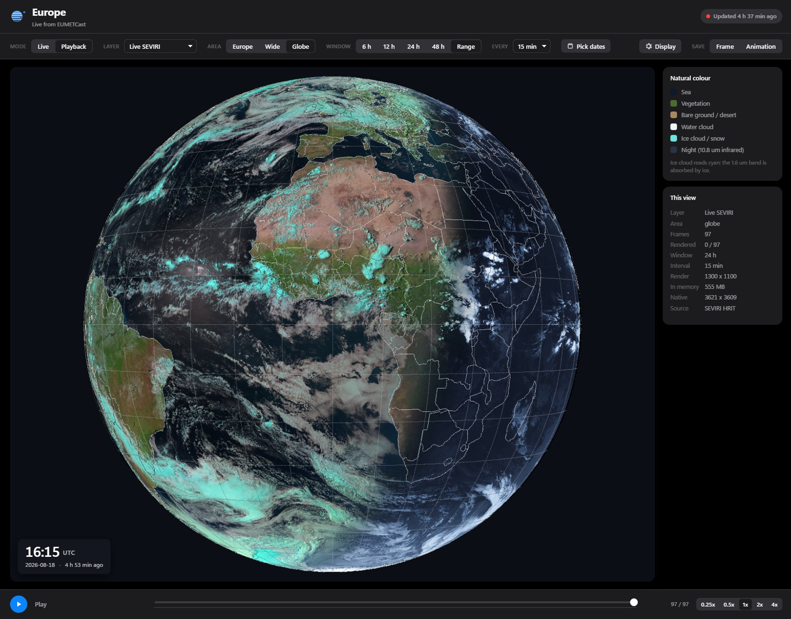

The same controls in the dark theme, on the *Globe* area with *Range* selected —
the *Pick dates* button beside Window is what Range reveals.

**Picking a date range.** Choose *Range* under Window and the calendar opens.
Days with imagery are marked, with a bar showing how full each one is; days
your receiver never got are inert. Click the first day, click the last, and it
closes — the button then carries the span. Clicking one day twice is a single
day, and clicking a later day before an earlier one is the same range. It is
UTC, like everything else here.

**Keyboard.** Space plays and pauses, the arrow keys step a frame — both only
when no control has focus, so they do not fight the widget under the cursor.

**A first run, end to end.** Point it at your data, open it, leave Mode on
*Playback*, pick *Live SEVIRI* and *24 h*, and press Play. It will render the
window — a minute or so cold, seconds once the cache is warm — and then loop.
Scrub with the timeline, change Speed to taste, and use *Save → Animation* if
you want to keep it.

## Running

```bash
cargo run --release
```

Then open <http://127.0.0.1:8787>.

### Pointing it at your data

The defaults are `C:\EUMETCast\received\bas\E1B-GEO-*`, the standard receive
layout. If yours are elsewhere - another drive, another root - pass them. There
are three, because the layers come from three different EUMETCast channels:

| flag | what lives there | feeds |
|---|---|---|
| `--dir` | NWC SAF products, `E1B-GEO-4` | Earth (natural), cloud type, cloud top temperature and height |
| `--hrit-dir` | SEVIRI HRIT, Rapid Scan, `E1B-GEO-5` | Live SEVIRI, surface heat and the three RGB composites, in the Europe and Wide areas |
| `--disc-dir` | SEVIRI HRIT, full disc, `E1B-GEO-3` | the same layers in the Globe area |

Overriding all three - here for a receiver writing to `E:` instead:

```bash
cargo run --release -- --dir      "E:\EUMETCast\received\bas\E1B-GEO-4" \
                       --hrit-dir "E:\EUMETCast\received\bas\E1B-GEO-5" \
                       --disc-dir "E:\EUMETCast\received\bas\E1B-GEO-3" \
                       --port 8787
```

Point each one at the directory holding the files themselves, not at a parent:
`--dir` expects `S_NWC_*.nc`, the two HRIT flags expect `H-000-MSG?__-*` segment
files. Subdirectories are not searched.

Any of the three may be left pointing at nothing. The server says so at startup
(`frames indexed: 0`, or `complete slots: 0`) and simply withdraws the layers
that directory feeds, rather than offering buttons that produce empty frames -
so with only `--hrit-dir` set you get the five raw-imagery layers, and with only
`--dir` set you get the four NWC SAF ones. Without `--disc-dir`, `Globe` lists
no frames while Europe and Wide keep working.

`eumet-stream --help` prints the same list with the compiled-in defaults.

### Deleting data as it ages

A receiver writes continuously and never tidies up after itself. `--retain-days`
deletes what has aged past a retention period, once at startup and then hourly:

```bash
cargo run --release -- --retain-days 10
```

It is **off unless asked for**, and starts with a dry run being the obvious first
move:

```bash
cargo run --release -- --retain-days 10 --purge-dry-run
```

which reports what would go and removes nothing:

```
  purge (5 days)  : would delete 17297 received files (11959 MB), 0 cached (0 MB)
```

Received data and cache are counted separately because they are not the same
loss: a cache entry costs a re-render, a received slot is gone for good.

Three rules make it safe to point at a directory the viewer does not own:

- **Only files it recognises.** A name has to parse as `S_NWC_*.nc` or an
  `H-000-MSG...` segment before it is even a candidate. Notes, logs, another
  service's output and subdirectories are left alone and not counted — a
  40-day-old product inside a subdirectory survives a 10-day retention, because
  subdirectories are not searched at all.
- **Age comes from the name, not the file.** The timestamp in the filename is
  when the satellite made the observation, which is the age that was meant.
  Modification time is when the file happened to land on this disk, which a
  re-transmission, a copy or a restore from backup all change. The decompressed
  segment cache is named the same way, so it ages on observation time too;
  rendered frames are named by content hash and have nothing but their own age
  to go on, which is fine because they rebuild on demand.
- **Nothing recent, ever.** The floor is one day, clear of the longest window
  (48 h), of the products lagging the imagery, and of the slot the receiver is
  writing as the purge runs. No combination of flags turns into "delete
  everything".

This is separate from the cache ceilings, which are about size rather than age
and apply whether or not retention is set.

### Reaching it from another machine

By default the server listens on `127.0.0.1` and nothing else on the network can
open it. `--bind all` listens on every interface instead, which is what lets a
phone, a tablet or another computer on your network view it:

```bash
cargo run --release -- --bind all
```

It then prints the address to type in — not `0.0.0.0`, which is not an address
you can visit, but the one this machine actually answers on:

```
  listening on http://0.0.0.0:8787
  on this network: http://192.168.1.42:8787
```

That address is found by opening a UDP socket toward a reserved, unrouted
address and asking the operating system which local address it picked. Nothing
is sent and no name is looked up; it just makes the routing table choose, which
is what picks the right one on a machine with several virtual adapters.

**There is no password on the server.** Anyone who can reach that address can
see the imagery and make the machine render frames, so `--bind all` is for a
network you trust — a home LAN, not a café. `--bind <addr>` also takes a
specific address if you want to answer on one interface only, and `--bind
localhost` puts it back.

On Windows the firewall will most likely block the port until it is allowed
once, and the server prints the exact command. It is not run for you: opening a
port is a change to the machine's security settings, and that is yours to make.

### What the server trusts

Two kinds of input arrive from outside the code: the files the receiver writes,
and the query parameters of a request. Neither is assumed to be well-formed.

**Files may be damaged.** Reception is a satellite broadcast onto a spinning
disk, and truncated and half-written files genuinely occur. Both readers are
built to fail rather than misbehave on one: the HDF5 cursor bounds-checks every
read and saturates on a skip, and the HRIT header parser requires each record to
be long enough for the fields read out of it, rather than trusting the length the
record declares. Checked by feeding 320 corrupted product files and 321 corrupted
segments — truncations across the whole length, and byte corruption through the
structural regions — through the paths a request takes: no panics, errors only.

**Sizes in a file are not trusted to be sane.** Three things in the HDF5 path are
sized by the file itself rather than by anything this code chose, and each is
bounded:

- **Array shape.** A dataspace declares its dimensions, and their product sizes
  the buffer. Multiplied with plain arithmetic that wraps, so an absurd shape
  becomes a plausible one and then a copy of the wrong length; multiplied with
  checked arithmetic it stays absurd and is refused. Anything over 512 MB is an
  error — a full SEVIRI disc is about 27 MB.
- **Deflate output.** A chunk's *compressed* size is bounded by the file; what it
  inflates to is not, and deflate expands by a thousandfold on repetitive input.
  Inflation stops at 64 MB, so a damaged chunk fails instead of consuming memory
  until the allocator gives up.
- **Layout offsets.** Compact and contiguous layouts carry an offset that may
  point anywhere; past the end they now read nothing rather than subtracting
  below zero.

The distinction that makes these worth bounding: a panic fails one request, but a
failed allocation **aborts the process**, and that cannot be caught. Everything
above turns the second kind into the first.

**Parameters may be anything.** The area must be one of the three that exist;
an unknown one is refused rather than quietly falling back to Europe, which hid
typos and, since the name went into the cache key verbatim, let any string mint
a fresh render and a fresh cache file for a picture already held. Output sizes
snap to a 100-pixel grid, which bounds the work a caller can ask for: the
accepted range is otherwise about 3000 by 2300 distinct sizes, each a full render
and its own multi-megabyte cache entry, all of the same picture. Requests never
name a path — the frame cache is addressed by a hash of the parameters, so no
input reaches the filesystem as a name.

**File text is not markup.** Class names come from the product file's
`flag_meanings` attribute, and `class_labels` turns underscores into spaces — so
a token written `<img_src=x_onerror=...>` arrives at the page as a working tag.
The legend used to build its HTML by string concatenation, which ran it. The
sidebar is now built as DOM nodes with `textContent`, and colours are checked
against `#rrggbb` before reaching a style attribute. Nothing on the page needs
markup from a file.

What is deliberately *not* there: authentication, rate limiting, and TLS. The
server renders on demand, so a caller can always make it work; the bounds above
keep that proportional rather than unbounded. `--bind all` is for a network you
trust.

## Layers

| Layer | Source | What it is |
|---|---|---|
| **Live SEVIRI** | raw HRIT | real imagery — natural colour by day, colourised 10.8 µm infrared by night |
| **Surface heat** | HRIT + `CT` | how warm the ground and sea are, with cloud masked away |
| **Airmass** | HRIT, 4 channels | jet streams and stratospheric intrusions |
| **Dust** | HRIT, 3 channels | Saharan dust and volcanic ash |
| **Night microphysics** | HRIT, 3 channels | fog and low stratus in complete darkness |
| Earth (natural) | `CT` + `ct_conditions` | green land, blue sea, white cloud, with a real day/night terminator |
| Cloud type | `CT` / `ct` | the official 15-class NWC SAF palette, read out of the file itself |
| Cloud top temperature | `CTTH` / `ctth_tempe` | continuous ramp, 200–300 K |
| Cloud top height | `CTTH` / `ctth_alti` | continuous ramp, 0–13 km |

Two modes:

- **Live** holds the newest image and refreshes it as slots arrive. There is no
  timeline and nothing to play; the button reads *Live* and the counter reads
  *newest*. Only that one frame is fetched. **Range is disabled here** — with no
  timeline there is nothing for a span of the past to be a span of, and choosing
  it would have loaded a range only to show one frame of it. It is dimmed rather
  than removed, so the control keeps its shape and the option stays
  discoverable. Coming from a range, the rolling window it replaced is what
  returns, and its button is marked again.
- **Playback** animates the window at the rate set by **Speed**. The button
  reads *Play* / *Playing*.

**Play renders the window first, then starts the animation by itself.** The
button counts the frames as they arrive and estimates the wait
("Rendering 42 / 96 - 65 s left"), only beginning to move once they are all in
hand. Doing both at once made playback stutter through frames the server had not
finished building. Pressing it again cancels, whether it is still rendering or
already playing.

Progress counts the **whole window**, not the frames the pass happens to be
missing. The frame on screen has already been rendered, so counting only the
outstanding ones left the label one short of the frame counter next to it.

The estimate uses the rate of the last eight frames rather than the average over
the whole pass, so it reacts when frames start arriving from cache instead of
being built. It stays silent until `concurrency` frames have finished: three
render at once, so when the first completes its siblings are already nearly
done, and estimating there overstates the wait by roughly threefold - measured
at "13 s left" on a job that finished in 9.

**Range** replaces the rolling window with a calendar, for replaying a
particular stretch of the past rather than the last N hours. It adds one button
to the toolbar carrying the chosen span, and the calendar opens from it. Click
the first day, click the last, and it closes:

```
      [ 16 - 18 Aug ]

      ‹   August 2026   ›   UTC
      Mo Tu We Th Fr Sa Su
                     1  2
       3  4  5  6  7  8  9
      10 11 12 13 14 15 16      13, 14, 16, 17, 18 are marked
      17 18 19 20 21 22 23      15 is not - no imagery that day
      24 25 26 27 28 29 30
      31

      2026-08-14 to 2026-08-18 - 4 days with imagery, 864 frames available
```

**It is a popover, not a panel.** The first version docked the calendar in a
band under the toolbar, which cost **310 px of the image** for as long as Range
was selected — undoing the point of moving the settings out of the toolbar in
the first place. A date picker is something you consult and dismiss, so it
behaves like one: the button shows the span, the calendar floats over the stage
without displacing it, and picking the second day closes it. Entering Range with
nothing chosen opens it once, so the calendar is not something you have to go
looking for. It shares the Display popover's dismissal — outside click, Escape,
and opening one closes the other. The stage measures the same height whether it
is open or shut.

**Only days the receiver actually holds are selectable.** `/api/range` returns
the day list with a slot count for each, and the calendar marks them; the rest
are inert. The bar under each marked day is scaled by how full it is, because
reception gaps leave days with a handful of frames rather than none, and a
half-empty day is worth seeing before you pick it. Hovering a day while one end
is down previews the span it would give. Clicking the same day twice is a single
day. Clicking a later day first and an earlier one second is the same range —
the ends are ordered, not assumed.

A chosen span is anchored to **the first and last slot those days actually
hold**, not to nominal midnights, so picking a day whose reception began at
08:25 gives a range starting at 08:25 and a frame count that matches what the
calendar promised. Everything is UTC, like the clock over the image.

This replaced a pair of `datetime-local` fields, which were worse in three ways:
they offered every date in the calendar including the overwhelming majority with
nothing behind them, they needed the range typed rather than pointed at, and
their commit behaviour was subtle enough to produce a bug — `change` fires only
when a field is committed, so a typed date silently did nothing while the note
beside it reported the new span.

Three limits apply, and each is enforced on the server as well as in the page,
since the API is reachable directly:

- The end must come after the start.
- A span may cover at most **31 days** — wider than the retention period, so it
  never becomes the thing that stops you replaying what you still have.
- A window still holds at most 400 frames.

That last one is handled differently for a range than for a window, and the
difference matters. A rolling window drops its **oldest** frames when there are
too many, which is right there: you asked for "the last N hours" and the newest
end is the point. A range names *both* ends, so cutting one off would answer a
different question — it **coarsens the interval** instead and keeps the whole
span. Asking for 16 Aug 12:00 to 18 Aug 06:00 at 5 minutes gives 251 frames at
10 minutes, covering exactly the span asked for. The interval picker follows,
so it always shows the interval actually in use rather than one that isn't.

**The interval ladder reaches far enough to thin the longest span.** It used to
stop at hourly, which is fine for a window and not for a range: a month at
hourly is 720 frames, past the ceiling, so the coarsening had nowhere left to go
and the range was cut instead — a month came back as its newest 16.6 days, with
nothing saying so. Two-, three- and six-hourly were added so the ladder can
always reach; a month at two-hourly is 360 frames. Aligning to a coarse interval
still moves each end inward by up to one interval, which is quantisation rather
than truncation, and a test holds that distinction.

Nobody would pick six-hourly for a six-hour window, and nothing stops them.

A chosen range is a fixed piece of the past, so the 45-second poll leaves it
alone — new data does not belong in it, and reloading would only lose your place.
Exports carry the range too, and the saved file is named for it rather than for
a window length.

**Speed** sets the playback rate: `0.25x`, `0.5x`, `1x`, `2x`, `4x`. One frame
every 150 ms at 1x — 6.7 a second, fast enough for cloud to flow and slow enough
to follow a front — down to 600 ms and up to 38. The choice is remembered, and
the button reads back the rate when it is not 1x (*Play 2x*, *Playing 2x*), since
at 4x a whole window is over in a couple of seconds and it is otherwise not
obvious why.

Changing it mid-playback restarts the ticker rather than the render: the frames
are already decoded bitmaps, so it takes effect on the next tick. Two things
scale with it. The end-of-loop pause divides by the rate, with a floor of 350 ms,
or a fast loop would spend most of its time sitting still. And the patience for a
frame that is not ready yet is counted in milliseconds rather than ticks — it was
ten ticks, which at 4x would have been a quarter of the wait and would have sent
the animation walking into frames the server had not finished.

Other controls: layer, window length (6/12/24/48 h), frame interval, area,
render resolution, overlays and theme. Space toggles playback and the arrow keys
step frames — but only when nothing else has focus, since space is also how a
focused button is pressed and the arrows are how the timeline is nudged.

The **This view** panel is rebuilt from live state after anything that could
change one of its rows, including how many frames have actually been rendered so
far, so it never describes a view you have moved on from.

When a loop reaches the end it **pauses, dims the image and shows a "Back to
start" badge** before restarting — about a second at 1x, scaled by the speed.
Without that, the wrap looks like the weather suddenly jumping backwards.

The window is measured back from the newest frame held, not from the wall
clock, so the view still fills if reception has paused.

### Time, freshness and updating

The frame time is shown large over the image itself rather than in the chrome,
because during playback it is the thing you are actually reading. It carries the
date and how long ago that frame was taken.

**It is UTC, and says so.** A slot is a UTC instant — that is what the satellite
stamped it with and what the filename carries — so the page never converts it to
the reader's zone. Shifting it would put the imagery an hour or more off its own
timestamp for anyone not on Greenwich, and would make two people comparing the
same frame disagree about when it is. The zone is named beside the digits rather
than left to be assumed, set smaller and dimmer because it is a unit, not part of
the reading:

```
16:30 UTC
2026-08-18 - 15 min ago
```

Only the "ago" is relative to you; the clock and date are not.

A pill in the toolbar shows the age of the newest image the receiver holds,
coloured green under 15 minutes, amber under 30, red beyond that. It is driven
by `/api/status`, which is polled every 45 seconds — and when that poll sees a
newer slot than the page is holding, the timeline extends itself. If you were
watching the leading edge it follows the new frame; if you had scrubbed back it
keeps your place. No reload, no interrupted playback.

### Interval and resolution

**Interval** picks the spacing between frames: 5, 10, 15, 30 or 60 minutes for
the Rapid Scan layers, 15, 30 or 60 for the NWC SAF products. Times are snapped
to whole multiples, so an hourly view really is on the hour rather than an
arbitrary stride through the slots.

**Resolution** sets how large each frame is rendered: `Auto` follows the
display's pixel density, `1×` and `2×` force it, and **`Native`** renders one
output pixel per source sample.

Native is computed, not guessed. `geo::native_span` walks the whole window
through the projection and reports how many 3 km samples it actually spans —
about **1959 × 725** for Europe from Rapid Scan, **2924 × 959** for Wide. The
span is set by the *southern* edge of the window, which lies nearer the
sub-satellite point and so subtends more columns per degree than the middle
does. Rendering finer than native cannot reveal more of the satellite image;
only the vector overlays keep sharpening.

Changing resolution re-renders the current frames without refetching the
timeline. Sizes are quantised to 100-pixel steps so repeated requests keep
hitting the server-side cache.

### Your location

**My location** drops a red dot on the map. It tries browser geolocation first,
but that needs a permission the user may refuse, is unavailable over plain http
from another machine, and silently returns nothing in some desktop builds — so
it falls back to typing coordinates, and remembers them in `localStorage`.
Appending `?lat=48.21&lon=16.37` pins a spot directly, which makes a useful
bookmark.

The marker is positioned in the page rather than drawn into the image: it costs
nothing to move, and it does not fragment the render cache into a separate copy
per location.

Placing it means **mirroring the server's projection in the page**. A linear
latitude/longitude mapping is right for a map but badly wrong on the disc, where
it put the pin in the wrong country, so `app.js` carries the same CGMS scan-angle
maths as `geo.rs` and `/api/native` reports the sub-satellite longitude and the
disc window to feed it.

### Export

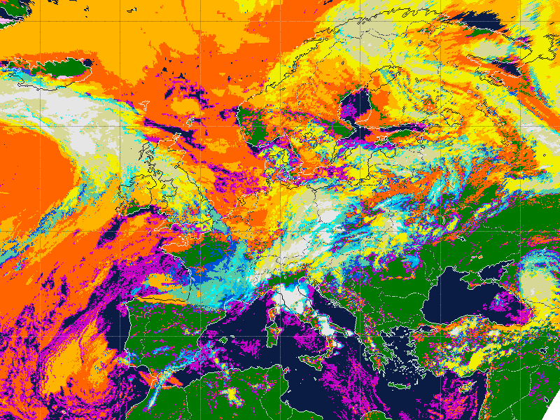

**Frame** saves the current image as a PNG. **Animation** packs the whole window
into one file and downloads it, **at the speed you were watching** — picking a
rate and then getting something else back would make the control feel like it
only applied to the page. GIF timing is in hundredths of a second, so the fastest
rates land on the nearest hundredth, and the server clamps to 1-24 fps.

The default is **GIF**, because APNG only animates inside a browser — Windows
Photos, Explorer previews and most desktop viewers show a single still frame,
which makes the download look broken. GIF is limited to 256 colours per frame
but plays everywhere. Add `&format=apng` for full colour if the destination is a
browser.

Exports render at the size currently on screen, so the frames are already in the
server's cache and only need decoding rather than re-rendering: a warm six-frame
export takes about 0.5 s against 0.9 s cold, and the gap widens sharply with raw
imagery, where a frame costs seconds to build.

The export accepts exactly the range a single frame does. It used to stop at
1600 × 1200, which quietly did two things on a large display: a page rendering
at 2000 × 1100 got a 1600-wide file without being told, and since that matched
no key in the cache, all 73 frames were rendered again. Sharing the bounds makes
the export the size that is on screen and lets it reuse those renders — the same
six-hour window went from **36 s to 4.4 s** at a *larger* size.

The other half of that is the encoder. Quantising to 256 colours is the whole
cost of a GIF once the frames are in hand, and each frame quantises
independently, so they are done across the cores and only written in order.

Frames are also rendered and encoded a batch at a time rather than all at once.
A frame is four bytes a pixel however well it compresses, so the old
all-at-once path wanted the entire window in RAM — over 900 MB for a full-size
export, and nearly four gigabytes at the cap. The batch is sized to a 256 MB
budget, which makes the peak flat in the number of frames: at 2400 × 1400 the
server peaks at 1222 MB for 73 frames and 1310 MB for 120, and almost all of
that difference is the larger output file, not working memory. Exports are still
capped at 120 frames, and the finished file is buffered before the download
starts.

### Surface heat

Cloud-top temperature tells you about cloud; this tells you about the ground.
It is the clear-sky 10.8 µm brightness temperature, with every pixel the NWC SAF
cloud classification flags as cloudy greyed out — otherwise cold cloud tops
would be painted as freezing ground. Snow and ice count as surface, since that
is genuinely what the instrument is seeing.

It tracks real skin temperature closely in clear air, but it is not an
atmospherically corrected land-surface-temperature product.

The mask comes from a different service than the imagery, and the two fail
independently: this receiver's own history contains a **40-hour hole in the
products** while the pictures kept arriving. The nearest product slot is
therefore only used if it is **within 30 minutes** of the image — the products
run every 15 minutes against Rapid Scan's 5, so some tolerance is needed, but
without a limit the nearest slot could be a day away and the view would mask
cloud using a mask from a different day, with nothing on screen to say so.
Beyond that, no mask is used: the layer draws cloud tops as cold ground, which
is at least visibly odd rather than quietly wrong.

### Interface

The page follows Apple's Human Interface Guidelines: the system font stack,
semantic colour roles rather than fixed greys, an 8-point spacing rhythm,
standard controls, and a material behind the time card.

**The controls earn their place or leave the toolbar.** They had accumulated
one group at a time until there were eleven of them, 43 buttons over four rows,
taking 43% of the height of a 1280 x 720 window — in a viewer, where the picture
is the entire point. Three changes, each following the guidelines rather than
taste:

- **Long lists became pop-up buttons.** A segmented control is for a small
  number of similar-width options; nine layers and eight intervals are a list.
  As segments they ran to 989 and 495 pixels, so the widest control looked like
  the most important thing on the page. As pop-ups they are 174 and 79.
- **Settings chosen once moved behind a disclosure.** Resolution, overlays and
  theme are set and forgotten, so they sit in a *Display* popover rather than
  competing with the layer and the window. It dismisses on an outside click and
  on Escape, which a bare `<details>` does not do by itself.
- **Playback controls moved to the play bar.** Speed belongs beside Play, not in
  a row of settings.

| at 1280 x 720 | before | after |
|---|---|---|
| control groups | 11 | **7** |
| rows | 4 | **2** (one at 1920) |
| chrome | 309 px | **233 px** |
| the image | 379 px, 53% | **455 px, 63%** (79% at 1920) |

**The calendar is a popover, not a band.** It began as a row below the toolbar,
which cost 310 px of the picture whenever *Range* was selected and kept costing
it after the dates were chosen — a control that is used for two clicks and then
finished has no business holding a permanent share of a viewer. It is now behind
the *Pick dates* button, which carries the chosen span as its label, and which
only appears in *Range* at all. Like *Display* it dismisses on an outside click
and on Escape.

Nothing in it asks to be confirmed: **the dates apply themselves**, the way
picking a window or a layer does. A *Replay* button had been the one control
that also wanted pressing afterwards, which made it look broken — you set the
dates, the timeline changed, and the button appeared to do nothing.

The calendar removed that whole class of problem: a click is unambiguous, so
there is no committed-versus-typed distinction to get wrong and nothing to
debounce.

**Live disables Range** rather than offering it and doing nothing with it. Live
holds the newest image and has no timeline, so a span of the past has nothing to
be a span of; choosing it there would have loaded a range and then shown one
frame of it. Switching to Live from a range restores the rolling window the
range replaced, so switching back is not a dead end.

**The logo** is the disc as the satellite sees it, crossed by the scan lines
that build the image, with the spacecraft off to one side at geostationary
height. It is inline SVG drawing from the theme tokens, and the favicon is the
same mark as a `data:` URI, so the page still fetches nothing.

**Native controls follow the chosen theme, not the machine's.** `color-scheme`
is what a `<select>`'s pop-up list, the date pickers and the scrollbars obey,
and it was left at `light dark` — so picking Dark on a light machine gave a list
that painted itself white while its text inherited the page's near-white label
colour. The layer names were invisible. It is now stamped alongside
`data-theme`, and the options name their own colours as well, for any browser
that does not honour it.

**Theme** offers `Auto`, `Light` and `Dark`, and remembers the choice. `Auto`
follows the operating system through `prefers-color-scheme`; the explicit
choices stamp `data-theme` on the root element, and the media query is guarded
with `:root:not([data-theme="light"])` so picking Light still wins on a machine
set to dark. Every colour is defined once per appearance as a custom property,
so nothing has to be restyled per component.

## The live SEVIRI layer

This reads the raw HRIT stream rather than a derived product, so it is the
actual picture the satellite took.

SEVIRI has no blue or green detector, so a literal true-colour photograph is not
physically possible. This uses EUMETSAT's standard **Natural Colour** recipe —
red from 1.6 µm, green from 0.8 µm, blue from 0.6 µm — which renders vegetation
green, bare ground in warm tones, water cloud white and ice cloud cyan. After
dark there is no reflected sunlight at all, so the image crossfades to
colourised 10.8 µm infrared using a solar zenith angle computed from the slot
time. Over a long window you watch the terminator sweep across the continent.

Counts are converted to radiance with the calibration table lifted from each
slot's prologue, then to reflectance with the published Meteosat-11 band
irradiances.

### The wavelet decompressor

HRIT pixel data is compressed with EUMETSAT's wavelet scheme (`compFlag = 1`,
lossless, roughly 2.3–3.9:1). There is no Rust implementation. EUMETSAT
open-sourced theirs under Apache 2.0, so it is built once and used as a helper:

```powershell
powershell -File tools\build-decompressor.ps1
```

That clones <https://gitlab.eumetsat.int/open-source/PublicDecompWT>, builds it
with your Visual Studio C++ toolchain, and installs `tools\xRITDecompress.exe`.

**Finding it.** If you already have a copy — a EUMETSAT install, a build from
elsewhere — you do not have to run the script. Drop the executable in the
directory you start the server from and it is picked up. The search, in order:

1. `--decompressor <path>`
2. the `XRIT_DECOMPRESS` environment variable
3. the **working directory**
4. the directory holding `eumet-stream` itself
5. the project root above `target\release\`
6. `PATH`

Each of 3–5 is checked directly and for a `tools\` beneath it, so the build
script's output and a binary dropped beside the exe both work.

`--decompressor` takes either the executable or the directory holding it:

```bash
eumet-stream --decompressor "D:\EUMETSAT\bin\xRITDecompress.exe"
```

Unlike the rest of the search, a path given on the flag is not searched past: if
nothing is there the server says so and exits, rather than reporting a
decompressor at some other path and leaving the typo to be discovered later. A
stale `XRIT_DECOMPRESS` does fall through to the search, because an environment
is inherited and forgotten in a way a flag typed for this run is not.

Without a decompressor at all, the four NWC SAF layers work normally and the
five raw-imagery layers simply do not appear in the picker.

Decompressed segments are cached under the system temp directory. A slot expands
to about 26 MB across the four channels, so the cache is pruned oldest-first at
3 GB. Because raw frames are expensive to build, a window is thinned to at most
`MAX_FRAMES` — 400 — so six hours still arrives at the full 5-minute cadence,
and only a long span at a fine interval loses anything.

### Three things that are easy to get wrong

All three fail silently, producing a plausible-looking but empty or wrong image:

- **LOFF is relative to the transmitted strip.** Rapid Scan sends only segments
  6–8 and shifts LOFF to match (`loff = -464`), so line numbers are anchored to
  the *planned start segment* from the segment-identification header, not to the
  top of the full disc.
- **CFAC/LFAC may be scaled for degrees or radians.** The two differ by exactly
  180/π — about 208 versus 11927 pixels per unit for SEVIRI. These files use
  degrees; much of the published MSG documentation quotes the radian form. The
  magnitude is used to detect which, and a test pins both.
- **Reflectance needs the factor of π.** `R = π·L/(E₀·cos θ)`, because the
  published band figures are total top-of-atmosphere irradiance. Dropping it
  leaves the whole scene about three times too dark, with cloud tops never
  reaching white.

## Overlays

One toggle, **Outlines**, drawing coastlines and country borders together.

**Coastlines are derived from the imagery**, not from a basemap: the NWC SAF
`ct_conditions` field carries a per-pixel surface classification in bits 4–5
(16 = land, 32 = sea, 48 = coast). The land/sea boundary is traced in *output*
pixel space after reprojection, so the line stays one pixel wide at any zoom and
is registered to the data by construction.

They are drawn over the live imagery too. The two products are geolocated
independently — one through CFAC/LFAC, the other through a GDAL geotransform —
so the coastline landing on the right pixels is a genuine cross-check of both.

**Country borders have to come from outside**, because nothing in a satellite
product knows where one country stops and the next begins. `assets/borders.txt`
holds Natural Earth's 1:50m admin-0 land boundaries (public domain), clipped to
this region and rounded to about 100 m by `cargo run --bin mkborders`. That is
102 KB of plain text, embedded in the binary, so the app still needs no network
at run time. Borders are only painted over pixels that already carry imagery, so
lines stop at the edge of the satellite's view instead of hanging in space.

Ink colour is chosen per pixel from the local luminance: dark over bright
palettes, pale over dark ones. A single fixed colour cannot work, because the
cloud-type palette runs from near-black sea to white cloud and the temperature
ramp is almost black at its warm end, so any one choice vanishes somewhere.

## Infrared composites

Three standard EUMETSAT recipes, each feeding the colour guns from brightness
temperatures or channel differences. Being infrared, they work identically by
day and by night.

| Layer | Recipe | Reading it |
|---|---|---|
| Airmass | WV6.2−WV7.3 / IR9.7−IR10.8 / WV6.2 inverted | green is moist tropical air, ochre is dry descending air; the sharp boundary follows the jet |
| Dust | IR12.0−IR10.8 / IR10.8−IR8.7 / IR10.8 | dust and ash appear magenta against neutral cloud |
| Night microphysics | IR12.0−IR10.8 / IR10.8−IR3.9 / IR10.8 | fog and low stratus glow cyan where visible light shows nothing |

Recipes are declarative — each gun is a `Single` channel or a `Diff` of two,
with a range and a gamma — so adding another is a few lines in `src/rgb.rs`.
A reversed range (`hi < lo`) inverts the gun, which several recipes rely on.

## Areas

`Europe` and `Wide` come from **MSG-4 Rapid Scan** (`E1B-GEO-5`) at 5-minute
cadence. **`Globe`** shows the whole Earth, and has to come from somewhere else:
Rapid Scan only transmits the northern third of the disc. The full disc is the
0° service (`E1B-GEO-3`, MSG-3, all eight segments), which repeats every 15
minutes — so the interval picker offers 15/30/60 there rather than 5.

The globe is drawn in the **satellite's own geometry** rather than reprojected.
Flattening a whole disc onto a latitude/longitude grid stretches the limb beyond
recognition, so `Canvas::Disc` scales scan angles straight onto the canvas and
`inverse_scan_angles` turns pixels back into coordinates for the sun angle. A
test asserts the forward and inverse projections undo each other — a sign error
there mirrors the globe with no other symptom.

The disc uses **one angular scale for both axes**, sized from the shorter side of
the canvas, so the Earth stays circular on any window shape instead of being
stretched to fill it. A test checks that two points equally far from the
sub-satellite point land equally far from the centre, on square, wide and tall
canvases alike.

Coastlines on the globe come from the embedded global vector set, since the
NWC SAF geography mask only covers Europe.

## Why there is a hand-written HDF5 reader

The NWC SAF products are netCDF-4, which is HDF5 underneath. Every Rust netCDF
and HDF5 crate binds to the HDF5 C library, which needs its own toolchain and
CMake. `src/hdf5/` parses the container directly in safe Rust instead, covering
the subset these files use:

- superblock versions 0, 2 and 3
- object headers version 1 and version 2 (`OHDR`), with continuation blocks
- **dense** link and attribute storage via the fractal heap (`FRHP`/`FHDB`/`FHIB`)
  and its doubling table — these files use no symbol tables at all
- the global heap (`GCOL`) for variable-length strings
- contiguous, compact and chunked layouts, chunks indexed by a version 1 B-tree
- the deflate, shuffle and fletcher32 filters

One detail worth recording, because it also fails quietly: in a version 1
attribute message the name, datatype and dataspace sections are each padded to
an 8-byte boundary, but **the data section is not**. Padding it too
desynchronises every following attribute in the heap block, which reads as a
file that is *almost* correct — 5 global attributes recovered instead of 40.

This is not a general HDF5 implementation. It rejects what it does not
understand rather than guessing.

## Projection

Both paths share one core: latitude and longitude are projected to CGMS scan
angles, rejecting anything beyond the limb. The NWC SAF products scale those
angles into projection metres through the file's GDAL geotransform; raw HRIT
scales them with CFAC/LFAC. `cargo test` pins the shared core against the
metadata the files publish — `region_name` advertises `CENTRE=44N 0E`, and the
test asserts that 44°N 0°E lands on the centre of the grid.

## Layout

```
src/
  hdf5/        pure-Rust HDF5 / netCDF-4 reader
  hrit.rs      CGMS HRIT records: headers, calibration, 10-bit unpacking, assembly
  live.rs      natural colour + infrared night compositing
  solar.rs     solar geometry for the terminator and sun-angle correction
  geo.rs       geostationary scan angles and view windows
  catalog.rs   scans the receive directory, indexes slots by time
  product.rs   loads NWC SAF fields, palettes, geography and illumination
  render.rs    compositing, coastlines, colour ramps, PNG encoding
  rgb.rs       the infrared composite recipes
  anim.rs      batched GIF and APNG encoding for exports
  diskcache.rs bounded on-disk caches: measuring, pruning, atomic writes
  purge.rs     retention deletion of received data
  sysmem.rs    physical memory, to size the in-memory cache
  main.rs      axum server and JSON API
  borders.rs   embedded country boundaries
  web/         the front end
  bin/         inspection tools
assets/        compacted border polylines
tools/         decompressor build script, and the built binary
vendor/        PublicDecompWT checkout (git-ignored)
```

## Third-party data and code

- **PublicDecompWT** — EUMETSAT, Apache 2.0. Built locally, not redistributed.
- **Natural Earth** 1:50m admin-0 boundary lines — public domain.
- **66 Rust crates**, all permissive: MIT, Apache-2.0, BSD-3-Clause, Zlib,
  Unicode-3.0, 0BSD, BSL-1.0, Unlicense. **Nothing copyleft** — no GPL, LGPL,
  AGPL, MPL, CDDL, EPL or SSPL anywhere in the tree.

Every one of them is inventoried, with its licence text, in
[THIRD-PARTY-NOTICES.md](THIRD-PARTY-NOTICES.md). Publishing source triggers no
obligation — Cargo fetches the crates, this repository does not carry them — but
**a compiled binary must ship those notices with it**, because MIT and
Apache-2.0 both require their notices to travel with copies, and the
dependencies are linked into the executable.

### Inspection tools

```bash
cargo run --bin h5dump   -- <file.nc>   # members, attributes, values
cargo run --bin ctdump   -- <file.nc>   # decode a field, histogram its classes
cargo run --bin h5probe  -- <file.nc>   # trace dense attribute heap parsing
cargo run --bin livedump -- <hrit dir> out.png   # one raw frame, with diagnostics
```

## API

| Endpoint | Purpose |
|---|---|
| `GET /api/init` | available layers, their intervals, and window lengths |
| `GET /api/status` | newest slot per source, for the freshness pill and auto-update |
| `GET /api/frames?view=&hours=&step=&bbox=` | slots in the window at the chosen interval |
| &nbsp;&nbsp;`&from=&to=` | a range in place of the rolling window, as Unix seconds |
| `GET /api/range?view=&bbox=` | which days hold data, and how many slots each has |
| `GET /api/native?view=&bbox=` | native sample count and the window's bounds |
| `GET /api/legend?view=` | class colours, or the ramp and its range |
| `GET /api/frame.png?view=&t=&bbox=&w=&h=&coast=&borders=` | a rendered frame |
| &nbsp;&nbsp;`&win=` or `&disc=` | an explicit window, if you want one from the API |
| `GET /api/animation.png?view=&hours=&step=&bbox=&w=&h=&fps=` | the window as an animated GIF |
| &nbsp;&nbsp;`&from=&to=` | a range here too, the same as for frames |
| &nbsp;&nbsp;`&format=apng` | APNG instead, full colour but browser-only |

`bbox` is the area name — `europe`, `wide` or `globe` — rather than a bounding
box, which the name does not suggest; `win=`/`disc=` are how you pass actual
bounds.

`from`/`to` are what the calendar sends. They are bounded by
`MAX_RANGE_DAYS` — 31 — and a span too long for `MAX_FRAMES` at the interval
asked for is coarsened rather than truncated, so both ends survive.
`/api/range` is what tells the calendar which days to mark.

## Nothing renders until you ask

Only the frame actually on screen is ever rendered on its own. Resizing, or
changing layer, area or overlays, costs **exactly one render**; sitting idle
costs none at all.

Building a whole window is what **Play** commits to, and it finishes that before
the animation starts. The bar under the timeline fills as frames arrive.

This matters more than it sounds: a window can hold hundreds of frames and a
raw-imagery frame takes seconds to build, so rendering eagerly made the whole
interface feel broken.

## Performance

The globe is the demanding case: a full disc is eight segments per channel, so
one natural-colour slot is **32 separate wavelet decompressions** before a pixel
can be drawn. Three things were making that far slower than it needed to be.

**Decompression ran one segment at a time.** Each is an independent process, and
the machine has 24 cores. `hrit::warm_segments` now runs the whole slot's
segments in parallel before assembly.

The budget is **global rather than per-request**, which matters more than it
sounds. Measured on a single cold frame, throughput rises all the way to the
core count (8 workers 0.86 s, 12 workers 0.80 s, 16 workers 0.71 s, 24 workers
0.63 s). But several frames render at once, and a per-request limit multiplies:
at one-per-core, three concurrent frames spawn 72 processes on 24 cores and the
*batch* gets slower even though each frame looked faster. One shared budget
gives a lone frame the whole machine and a batch its fair share - worth about
0.15 s on a single frame and 2 s on a full window against either fixed choice.
`EUMET_DECOMP_WORKERS` overrides it.

**The pixel loop was single-threaded.** Every output pixel is independent - its
own inverse projection, sun angle and channel samples - so `render_bands` splits
the image into horizontal strips and hands each worker a disjoint slice of the
buffer, along with a matching slice of the surface mask the coastline is traced
from. No locking, and no seam: the bands are exact row boundaries.

**Every request re-walked the receive directory.** The HRIT folders hold over
40,000 files each, and they were being listed on every frame, every frame list
and every status poll. Listings are now cached for 20 seconds - slots arrive
every five minutes, so that costs nothing - and the scan happens outside the
lock so concurrent renders do not queue behind one directory walk. The NWC SAF
auxiliary, a full HDF5 decode needed by every regional frame, is cached the same
way for the slot in use.

Measured on this machine, all caches cleared each time:

| | before | after |
|---|---|---|
| cold globe frame, 900 x 900 | 4.0 - 5.1 s | **0.65 - 0.75 s** |
| cold globe frame, 1800 x 1800 | 4.15 s | **0.21 s** |
| frame list, globe | 85 ms | **10 ms** |
| **full cold 24-frame globe window** | ~40 s | **8 s** |

Re-requesting that window is instant, since the frames are on disk by then.

### Would a GPU help?

No, and the profile says why. Splitting a cold 900 x 900 globe frame:

| stage | time | share |
|---|---|---|
| wavelet decompression | 433 ms | 72% |
| segment read, 10-bit unpack, PNG encode | 152 ms | 25% |
| **the pixel loop** | **14 ms** | **2.4%** |

Only the pixel loop suits a GPU, and it is the part that is already cheap:
17.8 ms per megapixel, measured by rendering the same frame at four sizes and
fitting the slope. Making it *free* would save 2.4% of a cold frame, or about
11% of a large 2000 x 2000 one.

The 72% is entropy decoding of a wavelet bitstream - inherently serial per
segment, the classic case GPUs are bad at - inside an external EUMETSAT binary.
The parallelism worth having there is across segments, which is what the CPU
pool already does. The remaining 25% is disk reads and a bit-unpack, both
memory- and I/O-bound; uploading 110 MB of channel data per frame to VRAM would
cost more than the 14 ms it would save.

### Playback in the browser

Rendering fast enough is only half of it: the page still has to *show* the
frames. Filling a 2560 x 1440 display gives a stage of about 2246 x 1175, so a
six-hour window at five minutes is 72 frames of roughly 2000 x 1100. Swapping
those through an `` element played at **1.2 frames a second against a 6.7
target, with 1.6-second stalls**, even though every frame had already been
rendered and downloaded.

The cause is decoding, not rendering or the network. A PNG in the browser's
image cache is compressed; assigning `img.src` decodes it again, and once the
window is larger than the cache the browser evicts and re-decodes on *every*
step - two megapixels per frame, over and over.

So the stage is a `<canvas>`. Each frame is fetched once, turned into an
`ImageBitmap` - decoded off the main thread, then held in decoded form - and
every playback step is a `drawImage` blit. Same machine, same window:

| | `` src swap | canvas + `ImageBitmap` |
|---|---|---|
| effective rate | 1.2 fps | **6.5 fps** (target 6.7) |
| median step | 160 ms | **155 ms** |
| worst step | **1654 ms** | 159 ms |

With 286 frames held at once - a full 24-hour window at five minutes, 572 MB of
bitmaps - the blit itself measures **0.0 ms median, 1 ms worst**. The 150 ms
tick is essentially idle.

The one thing decoded frames cost is memory, and that is now the binding
constraint rather than speed: 2200 x 1200 is 10.6 MB a frame, so a 48-hour
window at five minutes would ask for nearly three gigabytes. The whole window
therefore gets a **600 MB budget** and the frame size is scaled to fit inside
it, which only bites when there are many frames - a short window still renders
at full stage size. `This view` reports the chosen size, marks it `(fitted)`
when the budget bound it, and shows the resulting `In memory` total.

### Keeping the frames across a refresh

That made playback fast but introduced a second, slower failure: it hung every
few replays. The status poll runs every 45 seconds, and when it sees a new slot
it refreshes the window - which threw away every decoded frame and started
again. A six-hour window is about 12 seconds of animation, so the wipe landed
roughly every fourth replay, and each one cost the *whole* window: the ticker
walked into undecoded frames, stalled its 1.5-second limit on each in turn, and
crawled at **0.8 fps with 1651 ms between frames**. Under the old `` path
the browser's own cache had been quietly absorbing this.

But a refresh does not replace the window, it *rolls* it: 72 of the 73 frames
are ones already in hand. So the bitmaps are now re-keyed rather than dropped,
leaving only the genuinely new frame to fetch, and a refresh arriving
mid-playback starts a prefetch for it instead of leaving the ticker to trip over
it. Same refresh, same window:

| | dropped and re-decoded | re-keyed |
|---|---|---|
| rate through the refresh | 0.8 fps | **6.3 fps** |
| median step | 1651 ms | **155 ms** |
| frames surviving | 0 of 73 | **73 of 73** |
| frames re-fetched, unchanged window | 73 | **0** |
| frames re-fetched, one new slot | 73 | **1** |

**They are keyed on the request each bitmap came from, not on the frame time.**
That distinction is the whole correctness of it. Every layer is derived from the
same slots, so `live` and `airmass` share all their timestamps, as do Europe and
Wide — and keying on time carried the previous layer's pictures straight into the
new one, so switching after a window had been rendered left the page saying
*Airmass* while showing Live SEVIRI, with all 73 frames byte-identical to what
was there before. The request URL carries the layer, area, size and overlays as
well, so a bitmap survives exactly when the picture really is the same one.

Over a minute of playback with the window rolled every eight seconds - nine
refreshes, five replays - the animation held 6.3 fps with a 155 ms median step,
and every gap longer than half a second was one of the six deliberate loop
pauses.

A size change or an overlay toggle changes every request, so nothing matches and
the window rebuilds - correctly, and without needing a special case. Those two
still drop their bitmaps outright rather than looking each one up, since none of
them could match; and a size change kicks off a prefetch rather than stalling
the ticker.

## Caching

Three layers, because the expensive work is worth never repeating:

- **Decompressed HRIT segments** on disk, pruned oldest-first at 3 GB. A slot
  expands to about 26 MB across four channels.
- **Rendered frames** in memory *and* on disk under
  `%TEMP%/eumet-stream-frames`, keyed by build, layer, time, area, size and
  overlays. Finished PNGs therefore outlive the process: restarting the server,
  or coming back to a window you looked at yesterday, serves from disk rather
  than decompressing and reprojecting again. This matters most for raw imagery,
  where a globe frame costs several seconds to build.

  The disk half is held to **16 GB**, sized for the demanding case: 400
  full-disc frames at 2400 square are 10.4 MB each, so a single long range is
  4 GB on its own. At the previous 2 GB the cache evicted frames from the start
  of a pass before playback reached them and re-rendered what it had just built.

  The memory half is sized **from the machine**, at startup: a quarter of
  physical RAM, no more than **8 GB** and no less than 512 MB. A fixed figure
  was wrong in both directions — it wasted a large machine or swapped a small
  one. Eight is where the ceiling stops earning its keep, because it already
  holds two full-disc windows and so covers switching between a pair of layers
  without touching disk; 512 MB is where one European window stops fitting, at
  350 kB a frame. On a machine that will not say how much memory it has —
  anything that is neither Windows nor Linux — it is 1 GB, low on purpose,
  because guessing high is the only way this can do real harm. The figure is
  printed at startup.

  Asking costs the crate its only `unsafe` block and its only `cfg`, both in
  [`src/sysmem.rs`](src/sysmem.rs): `std` has no memory API, and a dependency
  tree for one number was the worse trade. Windows calls `GlobalMemoryStatusEx`
  through a declaration of the kernel32 entry point; Linux reads
  `/proc/meminfo` in safe code; everything else returns `None`. A wrong answer
  costs throughput and never correctness, which is why it is allowed to be a
  guess at all.

  Both are ceilings rather than reservations: nothing is allocated up front, and
  340 frames of a European window measured 421 MB resident.

  Pruning walks the whole directory to measure it, which is 95 ms at 1700 files
  and closer to half a second at the 16 GB ceiling. It runs on its own timer for
  that reason; it used to run from the frame-store path, which put that sweep on
  the end of an unlucky render every couple of minutes.
- **Animation exports** reuse those same cached frames, decoding them back to
  RGBA rather than re-rendering.

Decoding runs off the async runtime, so scrubbing and playback stay responsive.

Four properties are worth spelling out, because each was once absent and the
absence was not obvious from the outside:

**Both caches have a ceiling.** The segment cache always did; the rendered-frame
directory did not, and had reached 2.3 GB and was still climbing. It is now
measured at startup and at most every two minutes afterwards, oldest first.
Eviction is by modification time, which here is creation time - nothing rewrites
these files - so it is first-in-first-out rather than least-recently-used. Read
times would be the better signal, but Windows disables last-access updates by
default.

**Cached frames do not outlive the code that drew them.** The key carries a
build stamp taken from the executable's own modification time, so rebuilding the
server retires every frame the old code left behind. Without it a change to a
palette or a projection would keep showing the old picture for as long as those
files survived, which is days.

**A half-written cache file cannot be mistaken for a whole one.** Both caches
are read back by checking that a file exists and is non-empty, which a truncated
file also satisfies - and a truncated *segment* is worse than useless, because
the unpacker pads short input with zeros and would paint the missing lines as
valid data. So rendered PNGs are written to a temporary name and renamed into
place, decompression runs in a private scratch directory and renames its result
in, and a segment whose data field is short is reported by name and deleted so
the next request rebuilds it rather than failing for as long as it survives.

**The same frame is never rendered twice at once.** A second tab, a reload, or
an export running beside the page would each have paid the full cost. Requests
for a frame already being built now wait for it: eight simultaneous requests for
a cold globe frame take 0.73 s, the same as one.

## A note on the source text

Every source file is **plain ASCII**. Non-ASCII characters kept getting mangled
by the shell tooling used to edit them (UTF-8 read as Latin-1, then written back
as UTF-8, turning `x` into `?-` and an em dash into `?"`), which then showed up
in the interface. Sticking to ASCII in source removes that whole class of
failure regardless of which tool touches a file next; the pages still declare
`charset=utf-8`, so genuine UTF-8 in *data* is unaffected.

## Notes and limitations

- The `Earth (natural)` layer is a composite of derived products; `Live SEVIRI`
  is the real imagery. Land there is a uniform green because nothing in the NWC
  SAF files describes land cover — no desert or forest is invented.
- Snow and sea ice in that layer are drawn with a cyan cast rather than the
  white they really are, so they stay distinguishable from cloud. It matches how
  ice reads in `Live SEVIRI`, where the 1.6 µm band is absorbed by ice and those
  surfaces genuinely come out cyan.
- **Cloud-free sea** is black in the shipped cloud-type palette, indistinguishable
  from space. It is drawn deep blue so the coastline reads. That is the only
  deviation from the official colours.
- On the two `CTTH` layers clear sky has no value and is left transparent.
- Only coastlines are drawn; there is no country-border data in these products.
- Gaps in a window are real gaps in reception. The receiver's own history is the
  limit — roughly four days here.
- Night-side infrared uses the published 10.8 µm spectral coefficients for
  display; it is not intended as a calibrated brightness-temperature product.
  Use the `Cloud top temperature` layer for that.
- Everything is in **UTC**, matching how the files are named. A slot labelled
  `16:45Z` lands at 18:45 local in central European summer time; that two-hour
  offset is not a delay. Measured dissemination latency on this receiver is
  **4.6–4.7 minutes** from nominal slot time to the file appearing on disk.
- On `Surface heat`, pale grey means cloud is in the way, not missing data.
  Cloud cover over Europe is frequently extensive, so a single frame can be
  mostly grey; scrub back through the window to find clearer moments.

## License

MIT — see [LICENSE](LICENSE). Dependency licences and the obligations that come
with distributing a binary are in
[THIRD-PARTY-NOTICES.md](THIRD-PARTY-NOTICES.md).

The imagery this renders is EUMETSAT data, and what you may do with it is
governed by your own EUMETCast licence, not by this one.
